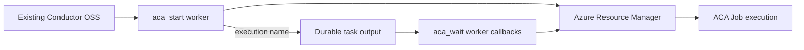

# Conductor OSS on Azure Container Apps Jobs

Run containerized work in Azure Container Apps Jobs while an existing Conductor OSS installation remains the durable control plane.

This is **existing mode**. It never deploys a Conductor server, UI, database, queue, or worker host. `azd up` creates only a sample ACA Job, its ACA environment, and Log Analytics.

This project targets the actively maintained [`conductor-oss/conductor`](https://github.com/conductor-oss/conductor) project and its official `conductor-oss/python-sdk` package, published as `conductor-python`. Conductor originated at Netflix, but the old Netflix-owned repository is archived/historical and is not the implementation or dependency source used here. The current project is maintained by Orkes and the Conductor OSS community.



## Requirements

- Python 3.10-3.14
- `conductor-python==1.5.1` (current stable used here; `2.0.0` was release-candidate at authoring time)
- An existing Conductor OSS 3.x server; current maintained server release observed during authoring: 3.31.0
- Azure CLI and Azure Developer CLI only when provisioning the sample target

## Quickstart

PowerShell:

```powershell
py -3.13 -m venv .venv
.\.venv\Scripts\Activate.ps1
python -m pip install -e ".[dev]"
pytest -q
azd auth login
azd up
```

Linux/macOS:

```bash
python3 -m venv .venv
. .venv/bin/activate
python -m pip install -e '.[dev]'
pytest -q
azd auth login
azd up
```

Live validation in `westus2` completed native Conductor single and five-way fan-out workflows and matched six successful ACA executions.

## Existing Conductor Integration

Install the package in a worker environment, set `CONDUCTOR_SERVER_URL`, `AZURE_SUBSCRIPTION_ID`, `ACA_RESOURCE_GROUP`, and `ACA_JOB_NAME`, then import `conductor_aca_jobs.workers` before starting `TaskHandler(scan_for_annotated_workers=True)`. Register `workflows/single.json` and `workflows/fanout.json` with your normal metadata promotion process.

The start worker returns a stable ACA execution name. Conductor persists it before scheduling `aca_wait`. Each wait callback receives that same name and returns `TaskInProgress`, releasing the worker between polls. Worker restart and task retry therefore resume one execution rather than starting another. The five-way workflow uses a native `FORK_JOIN` and `JOIN`; terminal branch failure prevents workflow success and downstream completion.

## Production Concurrency

`scripts/generate_fanout.py` emits native Conductor `FORK_JOIN`/`JOIN` definitions for `1` through `50` shards. With no arguments it reproduces the registered `aca_five_way_fanout` definition. Generate and register a separate 25-shard definition with:

```powershell
python scripts/generate_fanout.py --shards 25 --output workflows/fanout-25.json
$definition = Get-Content workflows/fanout-25.json -Raw | ConvertFrom-Json
Invoke-RestMethod -Method Put -Uri "$env:CONDUCTOR_SERVER_URL/metadata/workflow" -ContentType "application/json" -Body (ConvertTo-Json -InputObject @($definition) -Depth 100)
```

Start it as workflow name `aca_25_way_fanout`, version `1`, with `correlation_id` in the workflow input. Capture the workflow ID, workflow status, fork branch count, join status, per-shard task status, ACA execution names/statuses, and each correlation ID (`<correlation_id>-<shard>`) as evidence. Set worker concurrency and callback intervals from observed behavior in your environment.

Only the five-way fan-out has live proof in this repository. The generated 25-shard definition is covered by offline tests; 25- and 50-shard runs have not been measured, and no throughput, quota, or completion-time result is claimed for them.

## Real Local Runtime

Start maintained Conductor OSS locally using its current CLI or container image, then run the smoke script:

```powershell
npm install -g @conductor-oss/conductor-cli
conductor server start
python scripts/local_smoke.py
```

The script registers both workflows through Conductor's metadata API, starts official Python SDK workers, and executes single and five-way workflows through `WorkflowExecutor`. It starts a local stateful ARM stub and sets the opt-in `ACA_ARM_ENDPOINT` override for the worker subprocesses, so the smoke is real Conductor execution but makes no Azure calls. It does not deploy Conductor.

## ACA Contract

The client reads the current job before partial overrides and preserves omitted image, command, args, environment, CPU, and memory. Secret environment inputs are ACA `secretRef` names. ARM calls carry the workflow correlation ID and `conductor-aca-jobs/0.1.0` User-Agent, retry only `429`/transient `5xx` with bounded exponential backoff and `Retry-After`, refresh once after `401`, and omit bodies from HTTP errors.

`Succeeded` completes the worker; `Failed` and `Canceled` fail it; malformed or unknown states are explicit errors. `max_polls * poll_interval_seconds` bounds execution wait, then requests ACA stop. Abrupt worker or server termination can leave ACA running; reconcile by persisted execution name and correlation ID.

## Security, Scale, And Cost

Use managed identity through `DefaultAzureCredential`. Grant only job read/start, execution read, and execution stop at the individual job scope. Never pass static tokens or secret values in workflow input. Bound Conductor worker concurrency and fork width to ARM throttling and ACA regional quotas. ACA execution compute and Log Analytics ingestion are billable.

## Checks

```powershell
ruff format --check .
ruff check .
mypy src
pytest -q
python -m build
az bicep build --file infra/main.bicep
```

CI needs no Azure credentials. Real local-server tests, live Azure validation, dependency and license audit, dedicated tree/history secret scanning, clean-clone validation, and independent review are complete. Repeated provisioning and cleanup were also verified. Status: **LIVE VALIDATED**.

## Troubleshooting And Cleanup

- Worker not discovered: import `conductor_aca_jobs.workers` before starting `TaskHandler`.
- `401`/`403`: inspect credential resolution and job-scoped ARM permissions.
- Workflow remains `RUNNING`: inspect worker logs and increase synchronous executor wait beyond callback/retry delays.
- `429`: reduce worker thread count or fan-out and increase callback interval.

```powershell
azd down --purge
```

Apache-2.0 licensed. The adapter, workflow definitions, smoke runner, tests, and infrastructure are independently contained here.